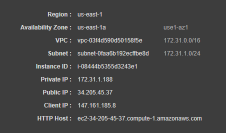

# AWS EC2 Network Status

This project proposes to build a *test* server to evaluate different AWS architectures:
- Load balacing in multi-az, multi-regions
- Disaster recovery
- ...

Making an HTTP request to this *test* server (or load balancer in front of it) will provide the following type of response:



## Installation from a "*naked*" Amazon Linux 2

```
# install nginx
sudo amazon-linux-extras install nginx1 -y

# install php
sudo yum install php -y
sudo yum install php-fpm -y

# configure php-fpm (from "apache" to "nginx")
sudo sed -i 's/^listen = 127.0.0.1:9000/listen = \/var\/run\/php-fpm\/php-fpm.sock/g' /etc/php-fpm.d/www.conf
sudo sed -i 's/^;listen.owner = nobody/listen.owner = nginx/g' /etc/php-fpm.d/www.conf
sudo sed -i 's/^;listen.group = nobody/listen.group = nginx/g' /etc/php-fpm.d/www.conf
sudo sed -i 's/^;listen.mode = 0666/listen.mode = 0664/g' /etc/php-fpm.d/www.conf
sudo sed -i 's/^user = apache/user = nginx/g' /etc/php-fpm.d/www.conf
sudo sed -i 's/^group = apache/group = nginx/g' /etc/php-fpm.d/www.conf

# configure nginx
mkdir /tmp/ec2-network-status
cd /tmp/ec2-network-status
wget https://raw.githubusercontent.com/cannereau/aws-ec2-network-status/master/nginx.conf
sudo mv nginx.conf /etc/nginx/conf.d/default.conf

# put status page
wget https://raw.githubusercontent.com/cannereau/aws-ec2-network-status/master/status.php
sudo mv status.php /var/www/html/index.php

## start nginx + php-fpm on boot
sudo chkconfig nginx on
sudo chkconfig php-fpm on

## start nginx + php-fpm now
sudo service nginx start
sudo service php-fpm start
```
